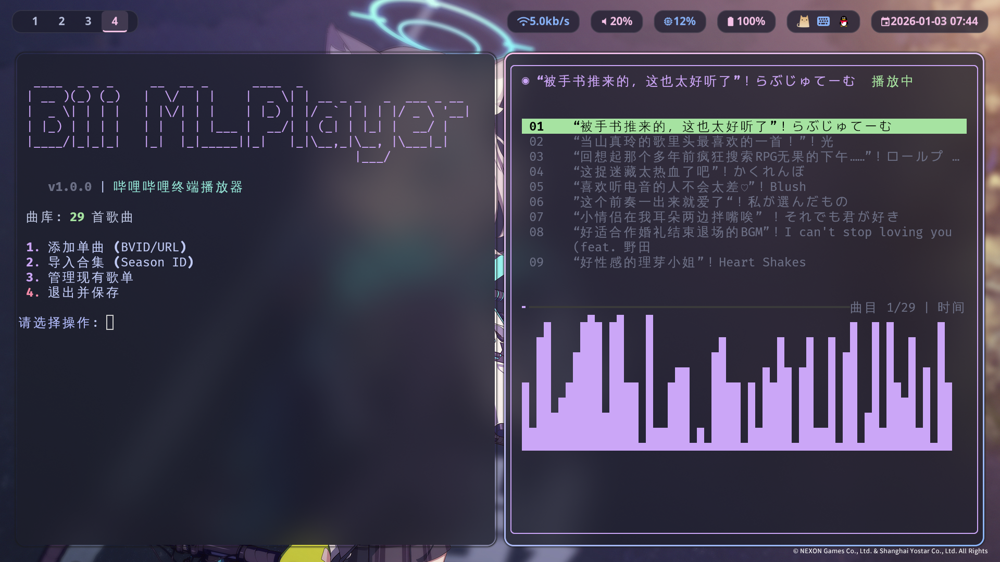
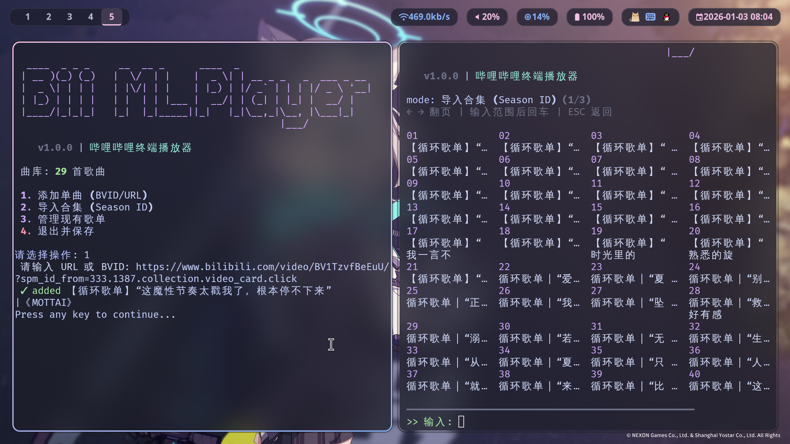
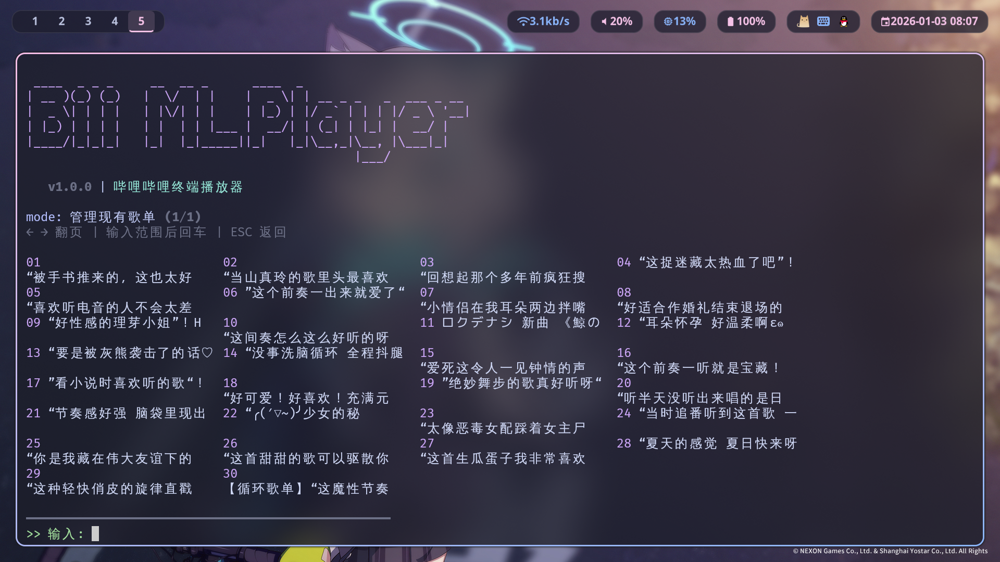

  

    <pre style="margin: 0; font-family: 'JetBrains Mono', 'Fira Code', monospace; line-height: 1.1; padding: 25px; border-radius: 12px; background: #1e1e2e; color: #f5c2e7; text-shadow: 0 0 10px rgba(245, 194, 231, 0.6); overflow-x: auto; text-align: left; font-weight: bold; border: none;">
  ____  _ _ _ ____  _ _ _     __  __ _      ____  _                      
 | __ )(_) (_) __ )(_) (_)   |  \/  | |    |  _ \| | __ _ _   _  ___ _ __ 
 |  _ \| | | |  _ \| | | |   | |\/| | |    | |_) | |/ _` | | | |/ _ \ '__|
 | |_) | | | | |_) | | | |   | |  | | |___ |  __/| | (_| | |_| |  __/ |   
 |____/|_|_|_|____/|_|_|_|   |_|  |_|_____||_|   |_|\__,_|\__, |\___|_|   
                                                              |___/           
    </pre>
  

  

    
    
    
  

  

    BiliBili Music Player 
    这是一款专为 Linux 极客打造的轻量级音频播放器。我们拒绝臃肿的 Electron，拥抱纯粹的终端体验。  
    <b>🌟 核心设计理念：</b> 
    • <b>流式播放</b>：不同于传统播放器先下载后播放的逻辑，本项目直接解析音频流，即点即播，节省磁盘空间。 
    • <b>海量资源</b>：直接使用 B 站作为底层音频库，无需担心曲库单一。通过技术手段播放流文件，在享受音乐的同时规避了复杂的本地版权管理问题。 
    • <b>开源集成</b>：深度集成 bilibili-api（赞美开源喵！），配合 <code style="color: #94e2d5; background: #313244; padding: 2px 6px; border-radius: 4px;">mpv</code> 高性能解码。
  

  <h1 style="border-bottom: 2px solid #f5c2e7; color: #f5c2e7; padding-bottom: 8px; margin: 0 0 15px 0;">📖 快速上手指南</h1>
  <h2 style="color: #89dceb; margin: 15px 0 5px 0;">1. 依赖准备</h2>
  

核心底层组件：
<ul style="color: #cdd6f4; margin: 5px 0 0 0; padding-left: 20px;"><li><b>Python 3.9+</b> (异步协程支持)</li><li><b>mpv</b> (音频流解码与 IPC 控制)</li><li><b>curl_cffi</b> (模拟浏览器指纹，绕过 API 风控)</li></ul>

  <h2 style="color: #89dceb; margin: 15px 0 5px 0;">2. 安装与构建</h2>
  <pre style="background: #181825; padding: 12px; border-radius: 10px; color: #a6e3a1; margin: 0; line-height: 1.4; overflow-x: auto;"><code># 克隆并安装依赖
git clone https://github.com/xieerfan/BilibiliPlayer.git
cd BilibiliPlayer
pip install bilibili-api-python curl_cffi readchar rich
pyinstaller --clean BiliPlayer.spec</code></pre>
  <h2 style="color: #89dceb; margin: 15px 0 5px 0;">3. 操作指令</h2>
  <table style="width: 100%; border-collapse: collapse; background: #313244; border-radius: 10px; overflow: hidden;"><thead style="background: #45475a; color: #f5c2e7;"><tr style="text-align: left;"><th style="padding: 10px;">指令</th><th style="padding: 10px;">说明</th><th style="padding: 10px;">备注</th></tr></thead><tbody><tr style="border-bottom: 1px solid #45475a;"><td style="padding: 10px;"><code>setmain</code></td><td style="padding: 10px;">初始化设置</td><td style="padding: 10px;">配置 Cookie 及登录</td></tr><tr style="border-bottom: 1px solid #45475a;"><td style="padding: 10px;"><code>play</code></td><td style="padding: 10px;">开始播放</td><td style="padding: 10px;">进入 TUI 频谱界面</td></tr><tr><td style="padding: 10px;"><code>-la zh/en</code></td><td style="padding: 10px;">语言切换</td><td style="padding: 10px;">i18n 国际化支持</td></tr></tbody></table>
  

界面预览：左侧配置模式 / 右侧播放模式

  <h3 style="color: #89dceb; margin: 15px 0 5px 0;">3.1 音乐获取方式</h3>
  

  
<ul style="color: #cdd6f4; margin: 0; padding-left: 20px;"><li><b>单视频</b>：输入 BV 号或 URL（自动存入 <code>~/.config/BiliBiliMusicPlayer</code>）</li><li><b>合集获取</b>：输入列表 ID（最多支持 100 首音频）</li></ul>

  <h3 style="color: #89dceb; margin: 15px 0 5px 0;">3.2 歌单预览</h3>
  

   
 
  <h1 style="border-bottom: 2px solid #f5c2e7; color: #f5c2e7; padding-bottom: 8px; margin: 0 0 15px 0;">🛠️ 技术实现原理</h1>
  
<h3 style="color: #89dceb; margin: 0 0 8px 0;">🎨 1. Rich TUI 渲染引擎</h3>
利用 <code>rich.layout</code> 组件化终端布局，通过监听 <code>SIGWINCH</code> 信号实现响应式窗口适配，10FPS 增量刷新确保低功耗下的流畅频谱跳动。

  
<h3 style="color: #b4befe; margin: 0 0 8px 0;">🔊 2. mpv 底层驱动与 IPC</h3>
通过 Unix Socket 建立 JSON-RPC 通信，实现对 <code>mpv</code> 进程的无损控制，实时同步音频时间轴与元数据到 TUI 界面。

  
<h3 style="color: #f2cdcd; margin: 0 0 8px 0;">🔐 3. 网络层风控规避</h3>
强制使用 <code>curl_cffi</code> 模拟浏览器 TLS 指纹，配合异步请求池优化，有效绕过 B 站对脚本化访问的流量识别。

